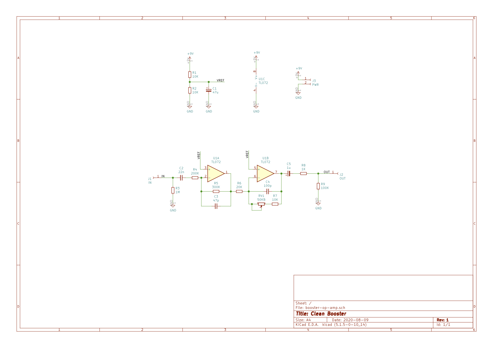
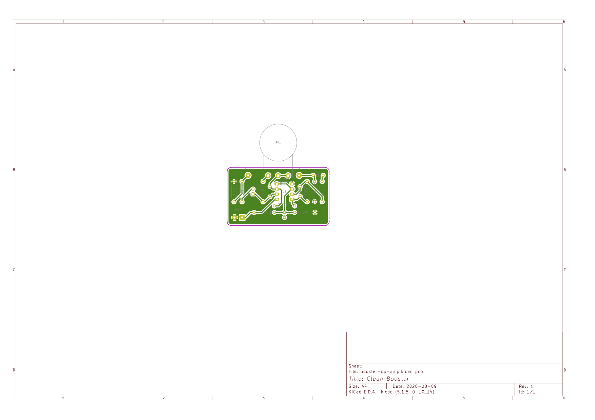

# Simple Clean Booster

OP-Amp guitar booster. Circuit based on [Deep Blue Delay bufer stage](https://sfxguitareffects.blogspot.com/2012/07/building-clean-boost-inspired-by-deep.html) but adopted to using more common electronic parts.

## Documentation

This project is created using [KiCAD](https://kicad-pcb.org/) v5.1.5. Gerber files are located in `fab` directory. Custom footprints may be found in `booster-op-amp.pretty` directory.

# Bill of Materials

| Designator | Package             | Quantity |
| ---------- | ------------------- | -------- |
| C1         | 47uF 16v            | 1        |
| C2         | 22nF                | 1        |
| C3         | 47pF                | 1        |
| C4         | 100pF               | 1        |
| R1,R2,R7   | 10K                 | 3        |
| R3         | 1M                  | 1        |
| R4         | 200K                | 1        |
| R5         | 300K                | 1        |
| R6         | 20K                 | 1        |
| R8         | 1K                  | 1        |
| R9         | 100K                | 1        |
| RV1        | 50KB (Linear)       | 1        |
| U1         | TL072, DIP8 Package | 1        |